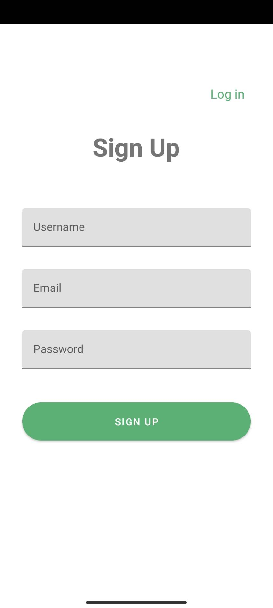
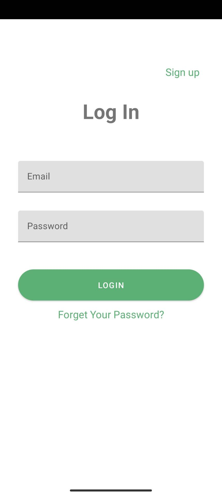
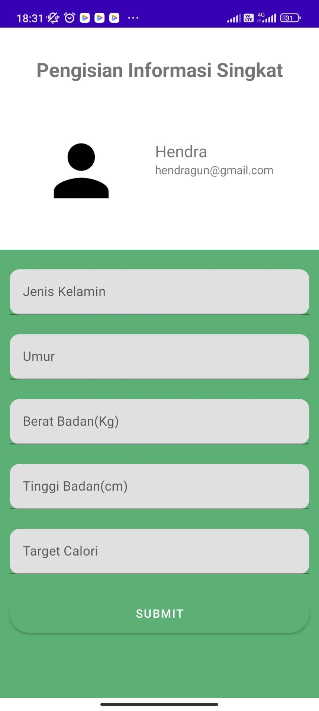
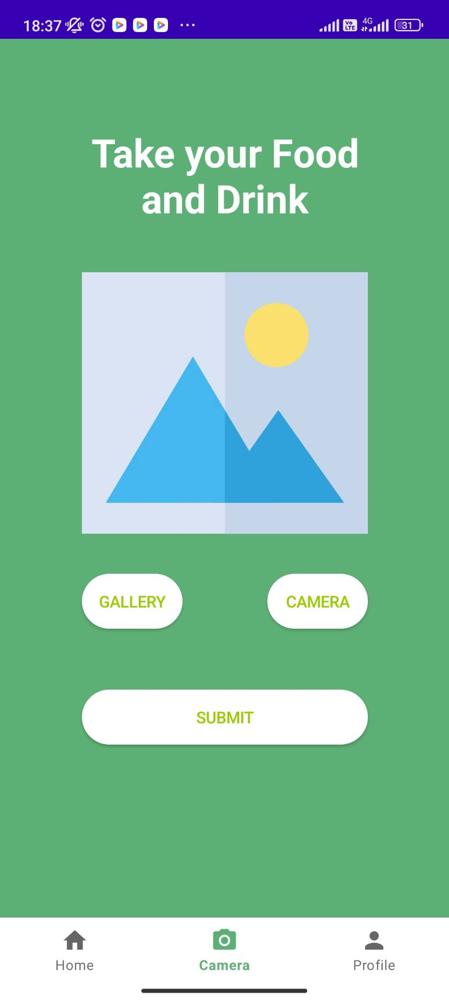
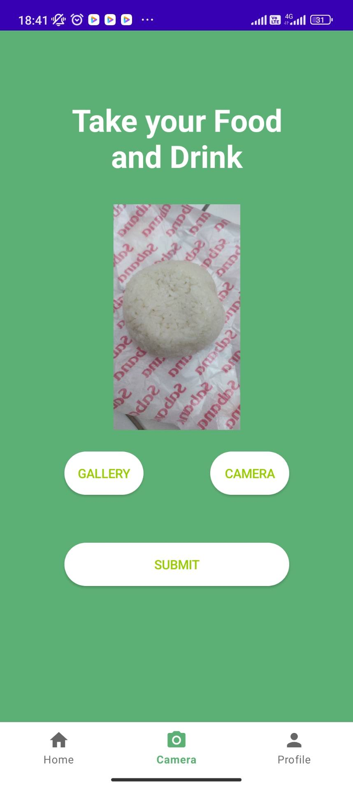
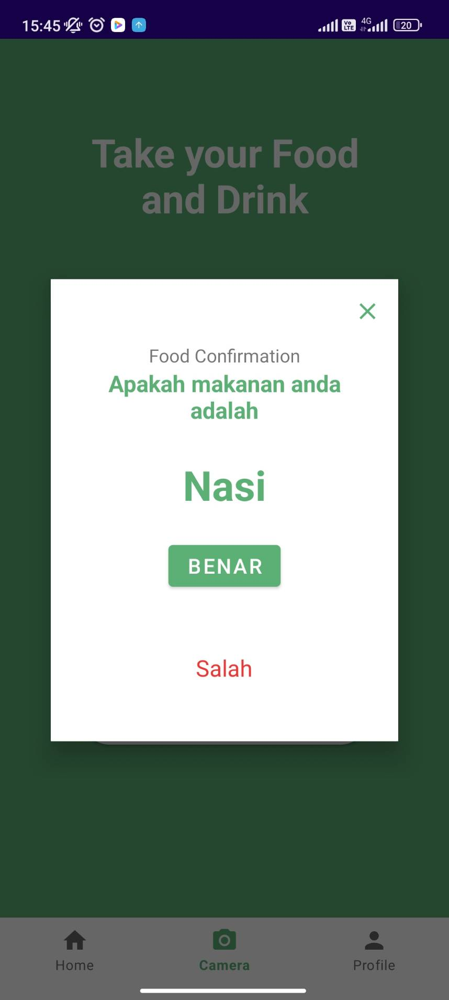
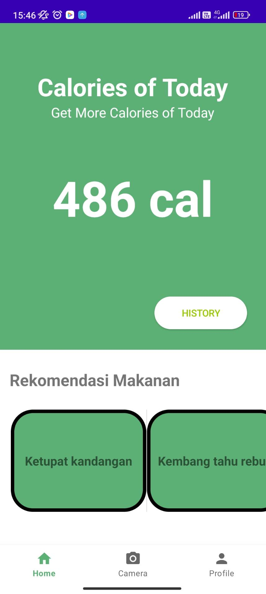

# Mobile-App
## Introduction
The mobile app serves as the primary interface for the NuSa Mobile application. It acts as the user's initial point of interaction, allowing them to directly engage with the app. Once the user inputs data, it is then transmitted to the API. Subsequently, the app presents the information retrieved from the API to the user.

## Features
+ Sign Up
+ Log in
+ Log Out
+ intent Camera
+ intent Gallery
+ Upload Food Image
+ Confirm Food Detection
+ Display Food Detail
+ Food Recommendation

## Overview

## Getting Started
to set up the project and start developing or testing this Mobile App
- clone this repo
